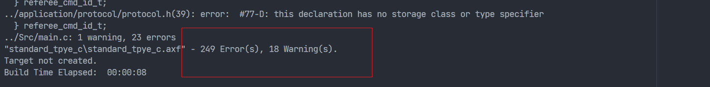
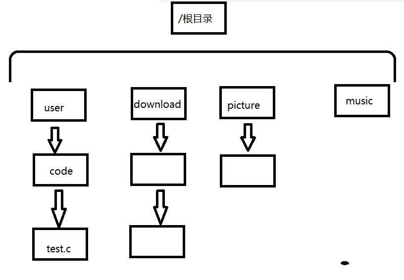
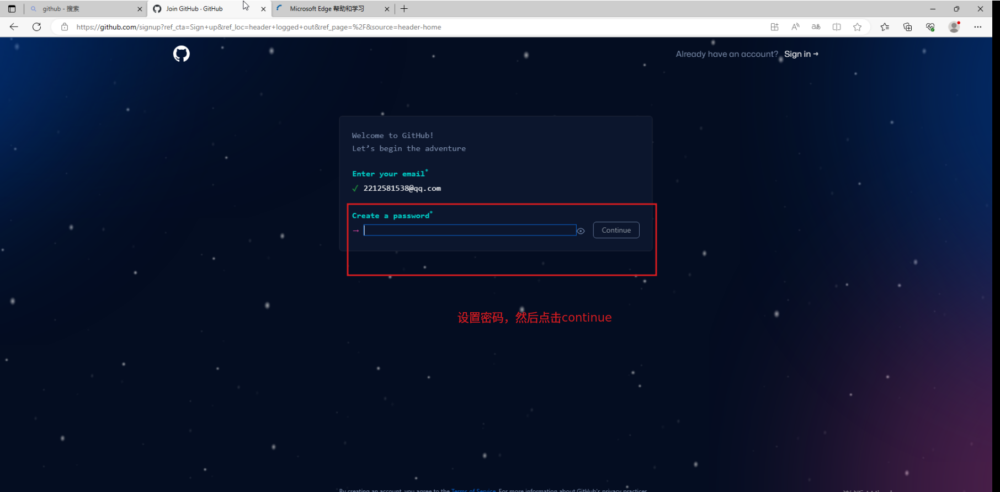
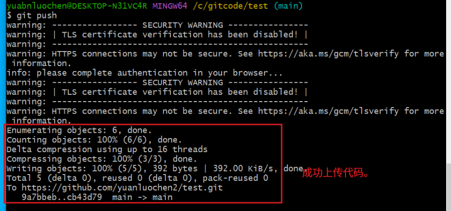
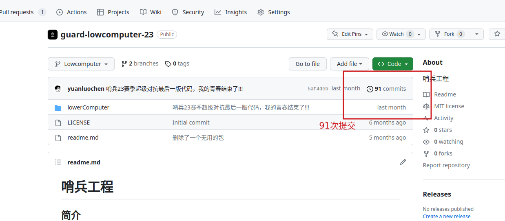

>**该文档归山东理工大学齐奇战队所有**
>本文作者为原落尘，邮箱为<yuanluochen@foxmail.com>，在下能力有限，如有问题，请您指出。

## 引言

试想一下，我们作为一名小白在开发一个项目，比如开发哨兵电控层面的代码，作为一个有追求的开发者，我想提升我的代码的质量，让其变得更加工整，我决定对我的代码进行修改优化，我在原来的代码基础上对我的代码进行优化，优化了一段时间，我编译了我的整个代码工程，编译之后，我发现输出窗口上输出了上百个上百个error和几十个worning，这一刻我自闭了  作为一名开发者我们绝对不容许一个error和一个worning的出现，于是我们开始修改我们的代码，想消除我的代码中的所有的worning和所有的error，经过一段时间的修改我们做到了0 worning和0 error这一个目标  但是经历了这一波修改，我再次运行了我的代码，我突然间发现我的代码跑不起来了。 这一刻我看了看我的代码，我思索了一会儿，我到底改了那里了，怎么跑不起来了?我试图把我的代码改回去，试图让我的代码回归能跑的状态，但是改来改去，越改越寄。

这时作为一名相对来讲比较可以的开发者会如何避免这种问题呢？答案是 **满屏的 '.zip'** 就像这样，我们在开发工程的某个重要的节点上，比如我们要更改当前工程的一些数据处理部分的代码，我们会为了防止毁坏原本的稳定的代码，我们特意把当前工程文件另存到一个特定的目录中（或者说文件夹中），然后为了节约存储空间对另存的文件进行了压缩存储。当我们更改工程时，我们发现，这个工程经过了我们的修改，毁坏了原有的工程，那么我们就删除这个被毁坏的工程，从过去压缩的代码中拿出最近一版代码，然后在这个过去版本的代码的基础上进行开发。

不得不说这是一个可行的方案，但是它也是存在一个巨大的问题的，就是保存一个版本占用一点空间，保存一个版本再占用一点空间。假如我们的工程未来发展到几个G大小的这种级别，我们在我们的有限的硬盘空间内存储几十个，上百个这样的历史版本代码的压缩包，我们的计算机该怎么办呢？ 

那么我们提出了另外一种方案，我们说本地存储空间不足，那么我们用**网盘**，我们将本地代码文件存在网盘上，这样问题不就解决了吗。我们把本地的数据上传到网盘中，我们既能满足保存历史所有代码的需求，又能满足节省本地磁盘空间的需求，这不一举两得吗，完美，这个方案是永远的神。

我感觉这个方案十分的完美，没有一点缺陷可言。回想一下，这是真的吗？当然不是。网盘方案有什么问题呢？当然是要联网啊，而且就算联网了，上传文件以及下载文件的速度也特别迷惑，感觉他们的速度和当前真实的网速有亿点点差异。我们如果采取网盘方案，假如说我们在一个网络较差或者根本没有网络的环境中，那么我们该如何上传当前代码或者下载我们过去版本的代码呢？答案是根本不行。

我们对比一下以上两种方法，一种本地存储所有历史版本的文件，一种将所有历史版本的文件上传到网盘上。这个两种方法各有所长，各有所短。存在本地，占用空间；存在远程，需要联网。那么是否存在一种集合了两种方案的优点，并且还能解决上面所有问题的方案呢？**有，就是git,一个分布式的版本控制方案。**

---

## 浅讲git

### 什么叫分布式版本控制

那么git是什么？ **git是一个分布式的版本控制工具**。当我看到这句话以后，我有了一个疑问，什么叫分布式版本控制？

#### 版本控制

首先我们要明确什么叫版本控制，版本控制就是我们之前所说的，在开发工程的某个重要的节点上，将工程代码另存到一个特定的目录（或者说文件夹）。在这里我们称这个特定的文件夹为版本仓库，这个仓库里存放着这个工程所有的历史版本代码。

#### 分布式版本控制

##### 集中式

那么什么是分布式版本控制呢，之前我们提到的将所有历史版本代码从本地移到网盘中，这种方式我们称之为，**集中式版本控制**。就是本地无任何这个工程的历史版本代码，所有的历史版本代码全部都存放在网盘中或者远程仓库中。我们想要开发这个工程。如果本地没有代码，我们首先要从网盘中下载最新一版代码，然后在本地继续开发这个代码，开发完毕之后我们为了进行代码的版本控制，我们需要将代码通过网络上传到网盘上，这就叫集中式版本控制，存储代码只在网盘上，其他地方没有一点关于这个代码的历史数据。这就引发了一个我们之前提到的问题，即网络问题。

##### 分布式

而分布式版本控制打破了集中式版本控制的控制方案，在分布式版本控制中，本地可以有一个存储代码所有历史数据的仓库，在遥远的网盘中也可以有一个存储代码所有历史数据的远程仓库，这两个仓库地位相同，都拥有着本工程的所有信息。。

这就是git的分布式版本控制，我们平时可以用git在本地建立一个仓库，我们把我们的代码用git放到这个仓库中，我们为了防止本地仓库出现问题。我们也在远程建了一个仓库。如图所示，我们把本地仓库的数据通过网络上传到远程仓库，这里的远程仓库就是这篇文章之后要讲的github（可能你看到这个词有点陌生，可能完全理解不了，但是也没有问题，文章以后就会讲到）。我们在本地保存一份，为了防止本地出现意外在github这个远程仓库上也保存一份我们的工程。这样我们不仅可以在本地不受网络影响进行本地的版本控制，也可以利用远程仓库备份数据，保证了就算本地仓库出现问题，也还有远程仓库为我们提供备份的代码。而且我们如果想更换设备开发这个工程，比如一开始用开发计算机1进行开发，现在我们突然想用开发计算机2进行开发。以前我会会把代码用u盘或者其他途径把代码拷贝到计算机2，但是现在我们可以用git把远程仓库或者之前的那个计算机（即图中的开发计算1的本地仓库1）的代码通过网络或者一些远程数据传输方式直接传到我们当前的开发设备。

这就是git的分布式版本控制，每一个地方都可以建立一个仓库，在不同的地方我们可以开发同一个工程，分布式管理，高效且自在。

##### git仓库存储历史代码的方式

前面认真阅读的朋友在这时可能会提出一个问题，如果本地仓库包含着所有版本的历史代码，那么我们的计算机存储不会出现问题吗？在计算机本地存储如此多的历史版本代码，我们的磁盘不会被撑爆吗？答案是不会的，作为一名稍微可以一点的开发者都知道，保存历史版本的代码需要将原本的工程文件夹变成压缩包来减少其在计算机内存储空间的占用，那么你觉得作为一个专业的也是现在最广泛被使用的分布式版本控制工具git它会不知道吗，并且git不仅知道这件事情并且对数据压缩作了特定的优化，能将一个大的文件压缩成一个很小的文件。而且在存储内容上**仅存储更改的文件，而不是存储整个工程文件夹**，这样就可以**从源头上减少了存储的内容**，大大节省了git仓库的占用空间。

---

## 开始真正学习git

前面咱们浅浅的讲解了一点git相关的内容，现在我们就可以正式的学习git。

### 安装git

在学习git之前我们的计算机中首先要安装git，那么如何安装git呢？下面我们在windows环境下演示安装git的操作。*如果您已经安装完成，直接跳转到[使用git](#使用git)

1. 首先下载git的安装包，进入[git安装包下载网址](https://git-scm.com/download/win)，进入网页后，点击红框内的64位windows版本的安装包进行下载 *可能你现在出现了一个下载不了的情况，这个正常，由于git的安装包存放在国外的网站上（详细一点说是github上），我们之前浅浅的说了一下github，说它是一个远程的仓库，或者一个网盘，git把代码以及安装包存放在github上，供我们这些开发者下载。国外的网站在国内可能不太容易访问。但是经常在玩一些国外的游戏作品的朋友，可能知道，玩一些国外的游戏我们会挂一个加速器，对某个游戏进行定点加速，让我登陆上这个游戏的服务器，可以与他人进行联机。那么我们在处理这种将安装包存放在外网上无法下载的情况，我们也是会采用加速器对github进行定点加速，以此链接上github，在github上下载git的安装包，那么如何实现对github进行定点加速请阅读[进入github的方法](#进入github的方法-瓦特工具箱)*
2. 寻找安装包的下载位置，点击安装。
3. 弹出该界面时点击 **是**
4. 弹出git安装界面，点击next 
5. 选择安装位置，点击next
6. 弹出该界面，选择安装内容，如果您想添加桌面图标，则勾选**Additional icons**,其他默认，然后点击next，如果不想添加直接点击next
7. 默认直接，点击next
8. 点击安装 
9. 验证是否安装完成，回到桌面，右键空白处，，出现上图黑框内的内容，则证明安装成功。

linux下的安装git的方法,终端输入。

```bash
sudo apt-get install git -y #debian系下的发行版
sudo yum install git -y #redhat系下的发行版
```

### 使用git

==以下的讲解在windows环境下进行==

当我们在我们的计算机上安装了git，我们鼠标右键点击桌面空白处，这时弹出的窗口内增加了两个选项。一个是 ==Git GUI Here== 另一个是 ==Git Bash Here==，我们点击Git Bash Here，然后会弹出一个窗口，如下图。。

我清楚的记得的我第一次看到这个界面时，我的感觉很是不解。为什么我会有这种感觉呢？因为我第一次打开一个软件，弹出的界面是黒黑的一片。我曾怀疑过，我是不是下错了。。

但是并不是这么一回事儿。git本来是一个linux系统下的软件。早期的linux或者说所有早期的计算机操作系统都是没有现在的图像化界面的，无法通过鼠标的点击实现开启和关闭程序，实现在文件管理器中进入目录（或者叫文件夹），退出目录，拷贝，剪切文件。那么他们通过什么来实现鼠标进行的操作的呢？就是**命令行**。

git最早是用于管理linux源代码的一款分布式版本控制工具，它的出现时间几乎和linux的出现时间等同。在那个时代的操作系统根本就没有图形化这种东西，每一个都是黑乎乎的命令行。早期的git就是运行在linux的命令行下的一款软件，上图那个黑黑的界面就是人们从linux系统下移植到windows系统下的linux的命令行软件。我们可以在这个命令行软件输入命令使用git。但是现在git也出现了图形化的版本，但是为了更加深刻的理解git的相关的知识，我们就在这个==Git Bash Here==中输命令的来了解和使用git。*可能有些人会有一点疑问，windows下没有类似的命令行么。答案是有的，它叫powershell，它是一款非常优秀的windows命令行*

#### 命令行的基本操作

回想一下过去，我们讲过版本控制的概念，以及一些简单的没有门槛的版本控制方法，例如，**满屏的 ".zip"**,以及**网盘**。思考一下，版本控制有什么共同的特点吗？答案是，都是通过 **操作文件** 来实现版本控制。版本控制的对象是文件，不管我们保留的历史版本，还是现在要开发的版本，他们都是文件。

在图形化界面中，或者说在现在的windows系统中以及喜欢图像化操作的使用linux的朋友们，我们如果用鼠标点击实现一个 **满屏的 ".zip"** 版本控制，我们都需要怎样的文件操作呢？简单来讲包括，进入我们要进行版本控制的工程文件夹，拷贝工程文件或者剪切文件。那么既然我们要开始通过敲命令学习版本控制了，那么我们在命令行中我们如何实现，位置移动，拷贝、剪切文件以及刚才没有涉及的创建文件夹，创建文件，删除文件。那么现在我们开始讲解一下这些操作的实现

##### 位置移动的相关命令

###### pwd 显示当前所处的绝对路径

我们想改变我们在计算机文件系统中的位置，我们首先要知道我们现在在那里。那么我们怎么知道呢？我们可以在Git Bash Here中输入 **pwd**。，然后它就会输出当前绝对路径 **/c/User/yuanluochen/Desktop**。

当你看到pwd的功能的时候你可能会好奇，“什么是路径”这个问题。那么什么是路径呢？路径是描述当前位置的一种方式。就是用来描述你到底在哪里的一方法。我们现在已经算是对路径有了一点点浅浅的了解，那么我们现在开始思考，什么是绝对路径呢？在理解绝对路径之前，我们先要明确如何在Linux系统中定位文件，在明确以上问题我们先要理解一个符号 **/**。这个符号是每一条绝对路径必有的内容，符号 **/** 在Linux系统中有两种含义，如果放在中间是路径分隔符，在Linux系统中是 **/**， 在Windows系统中为 **\\**。如果放在绝对路径的开头是根目录的意思。
  
当我们知道了 **/** 的含义时，我们就要开始理解 **绝对路径** 。以一条绝对路径为例，**/user/code/test.c**在这条路径中除了首个 **/** 为 **根目录** 外，其余皆为 **路径分隔符** 。那么为什么通过这种方式来实现文件的定位？

在现代，大多数操作系统组织文件的方式都是树形数据结构，及如下图所示

这种组织文件的方式使从根目录到目标文件的路径具有了唯一性。因为若要定位test.c文件，test.c文件的上级目录只能为code目录，code目录的上级目录仅能为user目录，user目录的上级目录仅能为根目录。由此从根目录到test.c的路径具有唯一性，我们就把这条路径称为 **绝对路径**。

有绝对路径，那么也必有 **相对路径** ，相对路径是什么，相对路径是从某一文件（不包括根目录）开始（默认状态下，从当前目录下开始），到目标文件的路径。此路径不具有唯一性。

仍以定位test.c文件为例，利用相对路径来定位test.c文件。

1. 从code目录开始，定位test.c文件，其相对路径为 **./test.c**（ 在这里 **.**  为当前路径, **/** 为路径分隔符）
2. 从download目录开始，定位test.c文件，其相对路径为 **../user/code/test.c**( 在这里 **..** 为上级目录 )

###### ls 显示当前目录下所有文件

现在我们已经知道了如何查看当前路径，我们也知道了我们在那，那我们怎么知道我们怎么去哪呢？我们想知道我们要去那里，我们需要知道我们有那些地方是可以去的，我们在有图像化界面的文件管理器中我们会查看当前我们这个文件夹下到底有那些文件夹。然后我们选择一个我们需要的进入。，那么我们怎么在命令行中查看当前目录下所有文件夹呢？用**ls**。如图所示

###### cd 切换路径

我们现在已经通过**ls**知道了我们当前目录到底有什么选择，那么现在我们就应该开始移动了。那么我们应该怎样实现呢？使用cd命令，该命令语法如下。

```bash
cd  路径 #移动到该路径下
```

我们在命令行中输入cd然后加要进入的路径。该路径可以为相对路径也可以为绝对路径。

###### 文件创建 目录创建 文件删除 目录删除 拷贝 剪切

以下皆为一些常用的文件操作命令，但是后面的讲解不使用，所以下面的指令我不会对其进行细致的讲解。

```bash
#文件创建
touch 文件名/文件路径
#目录创建
mkdir 目录名/目录路径
#文件删除
rm 文件名/文件路径
#目录删除
rm -r 目录名/目录路径
#拷贝文件
cp 被拷贝文件路径 拷贝到的目标路径
#拷贝目录
cp -r 被拷贝的目录路径 拷贝到的目标路径
#剪切文件
mv 被剪切的文件 剪切到的目标位置
#剪切目录
mv -r 被剪切的目录路径 剪切到的目标路径

```

###### 其他命令

```bash
clear #清空屏幕，或者说清空命令行的所有输出内容
```

---

==以上我浅浅的讲解了一点linux的指令，包括确定当前绝对路径的pwd，查看当前目录下有什么文件的ls，路径切换的cd，以及其他的文件操作命令，如果想真正的学习该部分内容，建议可以在b站着一些相关的视频认真学习一下linux。学习linux对你来讲是有益无害==

#### git的运行机制以及一些基本操作

讲了这么多前置知识，你可能已经看腻了。现在我们开始真正的讲一下git版本控制内在运行的机制，以及一些版本控制的基本操作命令。

##### git的运行机制

当你看到这张图的时候。它有很多陌生的词语，像工作区、暂存区、版本库以及远程仓库。对于一个初学者来讲可能有一点感觉难以理解，那为了帮助理解，我会一一讲解这些词语。

那么什么是 **工作区(workspace)** 呢？工作区就是存放我们整个正在开发的工程的地方，它实际上就是一个目录，这个目录存放着我们所有需要进行版本控制的文件。

那么什么又是**暂存区**呢？它是干什么的呢？我们要进行版本控制，我们之前提过[git是如何存储历史版本的代码](#git仓库存储历史代码的方式)的，git会检测当前工作区的文件与本地仓库的文件是否有差异，如果有差异，则找出有差异的文件，将有差异的文件进行特殊处理，降低其占用磁盘空间的大小，然后将经过特殊处理后的文夹保存在本地的仓库（或者版本库）中。那么在这个过程中暂存区起到了一个什么样的作用呢？那么我们现在开始思考一个问题，如果我们要完成一项工作，比如我们要运送货物。我们是喜欢一个一个的运输，还是喜欢将要运输的货物存放在一起后统一运输到目的地，如下图结果显而易见，我们喜欢一起运。而暂存区就体现了这一思想。工作区文件发生更改要提交到本地仓库，我们不会一个一个的提交，而是把所有要提交的文件都找出来集中放到暂存区中。然后统一提交到本地仓库。

**版本库(Pepository)** 和 **远程仓库(Remote)** 是什么之前在讲解git时提到过，它就是一个存放历史版本代码的地方，只不过一个在本地一个在远程的其他的地方。

那么现在我们明晰了一些最基本的词语。我们就可以开始真正的讲解一下这张流程图。在使用git进行版本控制时。我们起码要有一个git仓库，所以我们首先要创建一个git的本地仓库。然后当我们更改我们的工程时，想保存当前版本代码，我们首先就要将工作区内更改的文件，上传到暂存区，然后将暂存区的代码提交到本地仓库，然后如果我们有远程仓库我们可以将本地仓库的代码上传到远程仓库，并合并到远程仓库。我们也可以克隆远程仓库到本地，然后在本地开发这个工程。

##### 本地的版本控制

我们知道我们版本控制可以在本地进行也可以在本地加远程同时进行。我们现在先不讲解本地加远程的版本控制方案，我们先讲解本地版本控制的方法。

###### 创建本地仓库 **git init**

上文我们提到想要进行版本控制首先起码要有一个本地的仓库。那么我们该怎样创建本地仓库呢？

1. 首先我们要明确一点我们要在工作区下创建本地仓库，那么我们要对工程进行版本控制，我们首先要找到该工程的工作区，即该工程的工程文件夹的根目录，比如我要开发一个叫做guard的工程，guard目录内存放着该工程的所有文件。
2. 进入工作区，双击进入工作区
3. 在工作区根目录，右键文件管理器的空白部分，打开Git Bash Here，打开后我们输入pwd我们发现当前绝对路径，与文件管理器中所处的绝对路径相同。这也说明一点，我们在文件管理器通过右键打开Git Bash Here我们会自动跳转到当前路径。
4. 创建git仓库，我们在Git Bash中输入 **git init**，以此来创建本地仓库，或初始化本地仓库。，这时候我们就成功的在工作区中创建了本地仓库。然后我们使用文件管理器进入仓库目录。并且设置让文件管理器显示隐藏文件。，出现了一个名为.git的隐藏目录，这个目录是通过git创建仓库创建出来的，它是整个仓库中最重要的文件，它里面存放这个各个版本的代码。

###### 查看当前工作区文件状态 **git status**

由于后面我们要讲解git本地整体的版本控制操作流程，为了更深刻的讲解一下内容我先讲解一下一个命令

```bash
git status # 查看工作区的状态
```

这个命令是用来读取当前工作区状态的指令，我们在刚刚创建的仓库中输入git status，它就会它会输出工作区的文件状态。状态有如下几种情况。

1. 文件未跟踪 **untracked files** 如下图
2. 工作区与本地仓库相比存在有文件内容更改的文件
3. 文件添加到暂存区
4. 无更改文件，工作区与本地仓库数据相同。

###### 将更改的文件添加到暂存区 **git add 文件路径**

现在我们拥有一个本地仓库了。现在我们已经拥有了对工程进行版本控制的最根本条件了。现在我们就开始进行一次完整的版本控制。回忆我们在讲解[git的运行机制](#git的运行机制)的那张图纸。我们要进行版本控制，我们要保存我们当前版本的代码，我们应该先将本地仓库对应的工作区内的更改的文件添加到暂存区内。那么我们该如何实现这个过程？

在Git Bash Here中输入

```bash
git add 要添加到暂存区的文件的路径

```

如下图，这样我们就将我们的main.c和test.c分别添加到暂存区中。

为了提高效率我们也可以，直接用一个命令，直接添加该工作目录下的全部被更改的文件，输入

```bash
git add * # *表示该目录下的全部文件
```

如下图这样我们就一次将全部更改文件一步全部添加到暂存区中。

###### 从暂存区中提交到本地仓库 **git commit -m "提交记录说明"**

我们现在已经将所有相对与本地当前仓库最新版本的代码文件上传到本地暂存区了，那么下一步，就是提交代码了。我们在Git Bash Here中输入

```bash
git commit -m "提交记录说明"
```

这样我们就将本地暂存区的文件上传到本地仓库中了。

###### 添加git用户名

但是这时我们输入这条指令我们发现我们的命令行报错了，，这时，你可能感觉很奇怪啊，为什么会出现这个问题呢？什么叫**Author identity unknown**这是啥意思，原因是啥呢？因为你没有在git中添加你的账户。现在很多讲解git课程中它会都会在安装完git之后让我们在命令行中输入两个指令。

```bash
#添加git账户的用户名
git config --global user.name '用户名'
#添加git账户的邮箱
git config --global user.email '邮箱'
```

>里的用户名和邮箱建议用你的github邮箱，如果你不用你的github邮箱，在拟提交工程时，你的github就不会认为是你自己的提交的

这两个指令是用于添加git的账户的。我每次看它们的教程的时候我都会好奇添加它，到底有什么用？现在各位明白了么？你不添加账户，就无法提交代码到本地仓库，就这么简单。

git是可以用于多人开发同一个超级大的工程的，比如linux内核。我们如果共同开发一个工程，我们会把整个工程集中放到莫一个特定的远程仓库，如github或者自己团队搭建的个人服务器。我们多人开发同一个工程，会引发一个问题，就是不知道到底是谁提交的。试想，我们想管理一个团队开发一个大型的工程，多人同时向同一个地方提交代码，那么这个地方的文件会不会变得很混乱吗？为了让他变得整体变得更加清晰整洁，我们需要知道到底是谁提交了这个代码，那么我们想提交代码之前就一定要登陆我们账户，提交时顺便提交我们的账户信息。

我们在Git Bash Here中输入了这两条指令，如图，然后我们提交我们的代码，如果提交成功会输出如下，如图这也就证明了我们提交成功。

###### 查看历史提交 **git log**

我们提交了我们的代码，我想看一下我的提交的历史记录我该如何做，在命令行中输入

```bash
git log # 查看历史记录
```

我们的命令行中会输出以下内容由于我提交了两次代码，所以它会有两次的数据显示，每一次都有显示提交者数据，提交时间，以及提交的说明(commit)。

这个有什么用呢，我们能更加清晰的知道我们到底作了什么。我从编写哨兵代码开始我哨兵工程有90多次提交记录，当我每次查看我的提交记录时我会清晰的记得我的开发过程。它让我的开发思路更加清晰更加明了。

###### git的其他命令

```bash
# 删除暂存区内的文件
git rm -r 路径 --cached 


#删除git账户
git config --global --unset user.name #删除用户名
git config --global --unset user.email #删除用户邮箱

#本地链接远程仓库
git remote add origin 仓库的https的地址

```

##### 本地版本控制的总结

本地的版本控制就讲到这里，本地版本控制就几个核心的命令

```bash
#初始化git仓库
git init
#添加文件到暂存区
git add 文件路径
#将暂存区的代码提交到本地仓库
git commit -m "提交记录说明"
```

他们都有固有的格式，都是从git开始然后加操作。

```bash
git 操作
```

我不会把本地的版本控制讲解的太过复杂，我只会浅浅的讲一点最最基础的命令，git最核心的最精髓的**分支管理**是没有一点涉猎。我们未来开发项目的核心版本控制方法我更多的认为是，本地仓库与github的远程仓库进行配合，进行我们的版本控制方案。我感觉这样更加的符合一个初学入门者的需求。虽然我的能力上是不行的，但是我是可以尝试给你们讲解git的全部内容，但是我个人感觉对一个入门者来讲太累了。一个简单的开始，一个低门槛的开始，对于一个初学者是一个快乐的过程，是一个能坚持下去的过程。我认为我们应该先将这种比较基础的内容想通了，用熟了，你再去学习更加高级的方法，这样会更加快乐的学习。

---

## 使用github

本地仓库的基本内容已经基本讲了一下。我们现在可以开始讲一下本地加远程的共同版本控制。在讲解如何进行本地加远程的共同版本控制之前，我要稍微说一下github。

### github到底是个啥

我们曾经问过我的学弟，github是啥？它和我说它一个搞开源的网站。这个理解没问题，但是我感觉这么理解感觉对一个初学者有点高大尚了。它确实是用于开源的，但是我个人认为，作为一个开发者。github应该就是一个网盘，就是我们之前提到的存放代码的网盘，当然它不仅能存放代码，其他的什么东西都是可以存储的。

### 第一次进入github

现在我们明确了github到底是个啥，那么现在我们开始真正的进入[github](https://github.com/)，我们进入github。我们第一次进入会是如下这个界面那你成功的进入github了，这样的话你可以选择直接过下一段的内容，直接到[拥有一个github帐号](#拥有一个github帐号).但你更多的可能是第二种情况，根本无法访问， 如果你是这种情况请你继续阅读下面的内容。

#### 进入github的方法-瓦特工具箱

由于github是一个国外的网站，它的进入如果你没有一些特殊手段可能比较困难而且大部分是需要进行付费的，我就比较讨厌付费的东西，而且一名学习git的初学者，更是不想因为要学习一样东西而付费，为此我提出了一个解决方案，我们使用一款免费可以加速github的加速器——**瓦特工具箱**，这款软件可以实现我们对github的加速。使我们就这以正常使用github。(*如果你有一些特殊手段可以流畅的进入国外网站，请不要下载这个加速器，它可以会因为你的电脑同时存在两个加速软件可能会发生软件间的冲突，会让你的加速手段失效，如果你真下载了，不要让两个软件同时运行就一般是没有问题的*)

1. 下载安装瓦特工具箱
   1. 进入[瓦特工具箱的官方网站](https://steampp.net/)
   2. 在网址主页选择自己计算机系统对应的安装包点击下载
   3. 点击后会弹出以下界面，点击接受并下载。
   4. 点击后会弹出以下界面。建议采用蓝奏云网盘下载，它不会限速，而且支持在浏览器上下载，不用下载一点东西就要打开软件客户端，而且还限速。如果是windows用户还可以在微软商店上下载。，选择号下载方式，点击下载按钮。
   5. 进入蓝奏云下载，输入密码**1234**，点击确认。
   6. 选择x64（或者64位）安装包进行下载
   7. 选择任意一个下载方式进行下载
   8. 找到安装包下载位置点击安装。*安装位置视各自计算机情况而定，在你的计算机中不一点是我这个位置*
   9. 点击后计算机弹出如下界面，点击是。
   10. 点击后弹出安装界面，点击立刻安装或选择自定义安装，选择安装位置以后再进行软件的安装。，等待一段时间后软件安装完成。
2. 开始使用软件
   1. 打开软件的快捷方式，进入软件。勾选Github，点击一键加速。
   2. 第一次使用会弹出该界面，点击允许访问。
   3. 这一刻我们就开始正式加速github了。
3. 测试，进入[github](https://github.com/)，如果出现该界面，则证明我们成功了。

#### 拥有一个github帐号

现在我们已经可以进入github了，我们想使用github我们首先要拥有一个github的帐号，如果您已经拥有请跳转到下一部分[github的基本使用方式](#github的基本使用方式)

我们该如果拥有一个github帐号呢，请按我如下方式注册它。

1. 点击**Sign up**进入github注册页面。
2. 输入你的邮箱,然后点击continue
3. 设置你的密码,然后点击continue
4. 设置用户名，然后点击continue
5. 选择是否要接收产品邮件，我建议是输入n，不接收
6. 点击创建账户
7. 然后它会向你的邮箱发送邮件，接收到邮件后，输入邮件的验证码。
8. 进入该页面，选择一些符合自己的选择。
9. 然后我们就进入了github的个人页面

#### github的基本使用方式

我们现在已经拥有了一个github帐号。那么现在我们就可以进行正式的使用github。

##### 怎样学习使用github

在正式使用github之前我们先要对github页面进行一点介绍。我们刚一进入github页面，我记得我当时的感觉是，惊喜且不安，惊喜是因为什么呢？我感觉我进了一个特别吊的地方。不安又是因为什么呢？是因为我第一次进到一个都是英文的地方。我个人英语水平很差。我当时使用过一段时间github以后感觉，什么都不认识，每次使用都要用一下页面翻译，后来我也感觉这玩意用不明白，所以有一段时间我用了一下[码云](https://gitee.com/)，就是国内的github。但是用了一段时间感觉还是github好，之后就一直用到今天。

回忆一下，我一开始为啥不想用github，就是因为众多的英文。我执着于什么都要一次看懂，但是后来我发现并不是特别需要一次全搞懂。我们只要一开始先记住最主要的，然后最后最主要的用熟了，然后在往外拓展。那么现在我们回归正题，那么现在最主要的是什么？就是本地加远程仓库的版本控制，那么我们想学学会它，我们应该怎么做呢？我们从需求开始理解github的基本操作。

##### 远程仓库进行版本控制的流程

回忆一下我们用github来做什么？做网盘，保存本地仓库的代码。或者准确的说，在github中创建远程仓库，克隆github远程仓库到本地计算机中，将其变为本地仓库，并继续进行开发，然后将本地仓库的代码上传到远程仓库，进行本地仓库加远程仓库的版本控制。。

##### 创建远程仓库

那么我们怎样在github上创建远程仓库呢？

1. 点击这个位置的图标
2. 点击Your repositories(你的仓库)，打开仓库页面 。进入页面后，红框内的区域存放着我们创建的仓库。
3. 点击New新建仓库。
4. 输入创建仓库的名称，输入该仓库的描述，选择是否要开源，勾选添加README，点击绿色创建仓库数据。，当出现了这个界面，我们已经在github上创建了一个远程仓库

##### 克隆远程仓库的代码到本地计算机

我们该如何将远程仓库的代码克隆到本地计算机呢？利用git的克隆命令。

```bash
#将远程的git仓库克隆到本地，运行该命令的路径
git clone 仓库的地址
```

那么我们该如何使用这个指令，如图我们点击Code，选择HTTPS，拷贝地址，我们有了这个仓库HTTPS地址。我们首先在文件管理器中选择一个本地的路径去克隆这个仓库。然后右键打开Git Bash Here。输入git克隆指令去克隆这个仓库。

你可能会遇到如下情况，,这是一个在window系统下使用git会发生的一个常见问题，这是因为SSL安全验证问题。那么我们如何解决它，我们只需要关闭验证就可。如何关闭呢？直接在命令行中输入如下指令

```bash
git config --global http.sslVerify false 
```

这样我们就可以正常的克隆我们的仓库，如下图

现在我们查看一下，当前目录的文件。，我们发现当前目录下有一个与我们克隆仓库名字相同的文件夹。这个就是我们从github创建的名字为test的远程仓库克隆到本地的文件夹。我们进入这个文件夹，。我们发现本地仓库与远程仓库的文件内容相同。这也说明了我们这个文件是从远程克隆下来的。

##### 经典的版本控制操作

当我们将远程仓库克隆到本地，形成一个本地的代码仓库。我们把我们要开发的代码拷贝到这个从远程仓库克隆的本地仓库。然后我们就可以继续我们在本地仓库学到的经典操作。

```bash
#添加更改文件 我喜欢直接 git add * 一步添加所有文件
git add 文件路径
#将本地文件提交到本地仓库
git commit -m "提交版本的说明"
```


##### 将本地仓库的代码上传合并到远程的仓库 **git push**

我们将代码提交到本地仓库，那么在本地加远程版本控制方式。我们下一步该如果处理，应该将本地仓库的代码提交到远程仓库。该如何实现。输入指令

```bash
#提交到远程仓库
git push 
```

这时候会输出如下情况。我们点击红框的选择，点击绿色的选项，在新页面输入密码点击确认comfirm，成功上传代码

我们进入github远程仓库。查看和之前有什么区别。，我们发现我们的远程仓库多了一个本地仓库提交的文件。这时我们就成功向远程仓库提交文件。

==如果你使用vscode，并在vscode上登陆你的github帐号，你就可以不用输密码提交==

##### 回顾一下利用github进行版本控制的流程

现在我们开始回顾一下我们使用github构建远程仓库进行版本控制的流程。我们首先在github上创建远程仓库。然后利用克隆到本地，本地开发工程，将更改的文件添加到本地暂存区，然后将本地暂存区的文件提交到本地仓库，最后上传到远程的github仓库。

这个过程非常简单，并且高效，我认为你是可以使用这个流程进行舒适的版本控制的。

## 总结

回想一下我为什么会讲解git与github，之前实验室的代码开发一直都是采用满屏的.zip的版本控制方案，甚至有些人根本就从来不进行版本控制。对我们的实验室的整体开发产生了，不良的影响，并且不利于后期代码的迭代。使用git的最初的需求是让我们实验室下一代开发者，能在开发兵种代码时，能够使用，提高我们实验室的整体代码开发效率，以及更加利于后期代码的版本迭代。

我个人建议，我们未来应该采用[利用github创建仓库进行版本控制的方法](#回顾一下利用github进行版本控制的流程)，使用这种方法，开发每个项目组的工程。我感觉这种方法相对来讲是比较简单。从我刚开始调哨兵到最后一版哨兵代码，我就一直都在使用这种方式来管理哨兵电控层的代码，哨兵代码在我的github上已拥有91次提交，它清楚的记录了哨兵从一个连运动都困难，到今天一个能让我不留遗憾的作品。

我希望以后我们战队的所有软件开发人员，明年在兵种代码开发时全线使用git进行版本控制，咱先不需要做到太过复杂，我们就运行那几个经典的命令，我们就可以进行高效的版本控制。

```bash
#克隆远程仓库
git clone 远程仓库的地址
# 添加文件到暂存区
git add 文件的路径
# 查看是添加成功
git status
# 提交到本地仓库
git commit -m "提交说明"
# 提交到远程仓库
git push
```

## 展望

在比赛的时候，我与其他战队交流，一些历史悠久的战队，他们都有自己的代码仓库。我也想做一个属于我们自己的代码仓库，所以我们在github上建立了一个github的组织。。虽然我到现在我也没有想好，这个组织该如何运行。但是我想建立它，我想播下一颗种子。我想让每一代齐奇人都进入这个组织，我们把我们的教学文案，战队开发资料以及整个工程代码全部放上去，以供战队内部交流提升，并且利于后人查阅学习和代码迭代。这只是我的初期想法，我的眼见是比较狭小，我无法看的太远，我不知道如何正确的构建一个战队级的仓库，我更不知道以我的努力是否能实现真正的建立一个齐奇的代码仓库，但是我认为你只要开始用github了，只要你接触它了，以你们的创造力就一定能构建出一个优秀的代码仓库。

>这就是开发者小白的git的入门指南的所有内容，笔者能力有限，肯定有很多谬误，有问题请指出。  
>
>参考资料
>[一篇文章说清GIT的“分布式”是什么意思？](https://blog.csdn.net/xihuanyuye/article/details/84933134)
>[git怎么做到版本控制的？](https://zhuanlan.zhihu.com/p/127778152)
