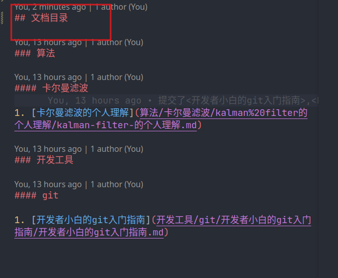

# 齐奇文档仓库提交说明

## 提交文档建议

本文档仓库提交文档建议为markdown文档，如您不了解markdown请进入[markdown官方](https://github.com/QIqi-RobotMaster-laboratory/Qiqi-Document)，了解markdwon这门文本编辑语言，如您想学习markdown建议可以进入[biliblib](https://www.bilibili.com/)搜索markdown，学习markdown的编写。

## 提交方法

首先克隆本仓库到你的本地计算机中。在你的计算机中选择合适的位置。在该位置打开终端，输入

```bash
# 将该远程仓库克隆到本地
git clone https://github.com/QIqi-RobotMaster-laboratory/Qiqi-Document.git
```

然后将你预添加的文档放入该仓库特定文件夹中。

然后修改本仓库的[README.md文档](../../README.md)，在文档目录栏添加你的文档跳转链接。

然后输入如下指令，将你预添加的文档提交到本仓库内

```bash
#添加到暂存区
git add *

# 添加到本地仓库
git commit -m "提交说明"

# 添加到本远程仓库内
git push
```

最后进入[本仓库](https://github.com/QIqi-RobotMaster-laboratory/Qiqi-Document)(点击即可直接跳转)，查看是否提交成功。
