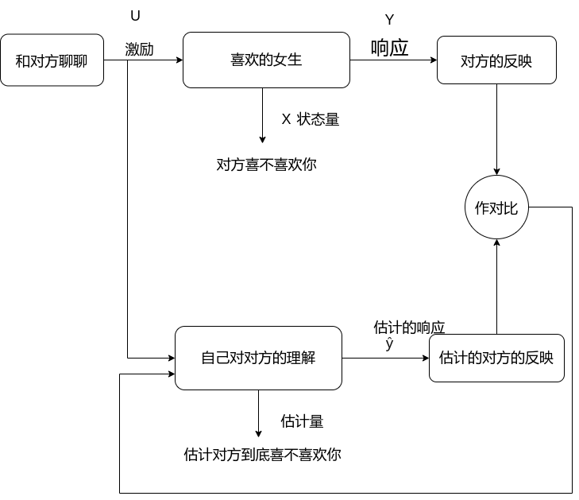

>**该文档归山东理工大学齐奇战队所有**
>本文作者为原落尘，邮箱为<yuanluochen@foxmail.com>，笔者能力有限，如有问题，请您指出.

## 什么是滤波

**卡尔曼滤波**，看起来十分高大尚的一个算法，但是当我们把卡尔曼这个修饰语去掉就变成了**滤波**。这一刻就突然间有一种灵光一闪的感觉，这时我们突然发现，“哦，它是一种滤波啊，就这？”

但是，之前的我作为一名小白，我甚至连滤波到底是什么我都不知道。我第一提出这个问题“什么是滤波，它有什么用”,我记得是我在阅读大疆robotMaster官方代码时提出了这个问题我记得当时的代码是这样的  
  
当时的我就提出了这个疑问，“滤波到底有什么用，为什么要将设置的数值经过滤波处理一下，如果没有滤波处理它会变成什么样子”，后来的我理解了，我也悟了。

在真实世界中，当我们想通过一个传感器测量一个数据，但是传感器测量的数值总有一些误差，比如我们想通过一个可以测量距离的传感器测量当前位置与墙之间的距离恰巧我们有两个传感器，一个精度极高，价格极贵；一个精度还可以，但价格十分亲民，这时候，我们使用这两个传感器测量距离，我们将测量的结果绘制一张图纸。

在最理想的状态下，我们希望图纸是如下状态，他是一个稳定的直线
  

但是在计算机世界总是有一点差强人意，它是这样一个状态，是由一个个小点点构成的  
  
这是因为什么呢，因为在计算机的世界中，一切都是离散的，不是连续的，不管是计算机还是传感器它们计算数据都是在时钟周期的影响下驱动的，时钟每运行一次，程序就会运行一次，它并非想理想状态下是一个由一条线构成的连续的状态，而是由一个又一个小点构成的离散状态。

但是想上图这样的图纸是真实的吗？结论是还不够真实，真实的状态比这还要难受，它更加的混乱。 如下面两张图所示

我们看到这张图已经感觉十分混乱了，但是还有更混乱的，如下图  
  
当我们看到者两张图纸，不知道你有没有一个疑问，为什么是混乱的。这个问题答案很简单，**我们的传感器不咋地**
  
原因就这么简单，没什么其他的原因，精度比较高的传感器还好，数据混乱度还可以接受，但是传感器精度不高，哎，不想说什么了，一言难尽。

但是我们发现，不管数据再怎么混乱，它们都有一个共同的特点，数据点的分布都以一个统一的数值为中心。当我们看到了共同点，我们再看看不同点，相比于第一个，第二个明显更加混乱，我们用更加专业的语言来分析这个问题，这时我们引入**高斯分布**的概念，可能有一些人不理解高斯分布，那么那我们说一个更加通俗易懂的，**正态分布**，这个名词我们高中就学过，可能有些人听到这个词语有一点陌生，但是我把下面这一张图拿出来应该立刻就想起来了  
  
当我看到这张图时，我脑中立刻回忆起高中的痛苦岁月，真难忘。

现在我们引入了高斯分布，或者说正态分布，这时我们在分析上面的两个混乱的图像，明显第二张图像比第一张方差更大。精度更高的传感器，方差小，精度低的，方差大，数据一言难尽。

### 开始讲滤波器了

我们如何解决数据分散，方差大的问题呢？这时我们就要用到滤波器了，哎，这么长时间了，终于开始讲什么是滤波器了。

那么什么是滤波器呢？拿这几张图为例  

    
简单来讲，**滤波器就是让图一图二逆天改命为图三的神器**，滤波器能将传感器得到的真实数据进行处理，让数据更加符合要求，更加平滑，这就相当于对数据进行淬体，化凡为仙，心动了吧。

这就是滤波器，回到我之前的那个问题，大疆官方的代码为什么要对数据进行滤波处理，答案一目了然，为了让数据更加平稳，更加平滑，更加符合我们开发者的需求。而卡尔曼滤波作为滤波的佼佼者，它的能力更加强大，它能降低方差，融合传感器的数据，让数据更加集中，能让数据更加贴近真实。

## State Observer 状态观测器

### 卡尔曼滤波是一种状态观测器

卡尔曼滤波器是可以实现最优估计的状态观测器。刚看到这句话可能有一点复杂。但是不要着急。我们先从状态观测器开始讲起，然后我们在开始讲解卡尔曼滤波

### 什么是状态观测器

在讲解相对复杂的卡尔曼滤波之前，我们先从初级关卡入手，理解一下什么是状态观测器。讲一个比较有趣的例子

假如你喜欢一个女孩，但是你不知道对方到底对你是否有那方面想法，作为一名理工男，你渴望能够通过一种传感器来直接判断对方的想法，但是没有啊，这个时候你十分的苦恼  
  
那光苦恼可不行，那这个问题该怎么解决呢？这时我们想到了我们突然间想到了状态观测器。“有办法了”，为确定对方是否喜欢你，这个**估计值**，你要通过对对方施加一些**激励**，或者说是与对方说几句话，通过观察对方的反映或者**响应**来判断对方的想法将反映与自己的预期进行对比，得出结论对方到底喜不喜欢你。

没想到吧，这么符合逻辑。不愧是理工男，现在我们回顾一下上面那个例子，反思一下什么是状态观测器，状态观测器是什么，**状态观测器是一个可以通过测量一个间接值来估计需求值的一种神器。**

### 状态观测器到底是怎么工作的

现在我们开始正经的讲解一下状态观测器吧，还是以一个例子启头，作为一名理工男，不研究火箭对得起自己吗，现在我们开始研究一下火箭作为一名未来的火箭工程师，我们要研究控制火箭尾部火焰温度，学过一点控制相关的东西的同学都知道，如果想要控制一个量，我们就必须要测量这个量，但是火箭啊这个东西温度太高了，如果你用一个温度计，放到火焰里来测量火焰的温度，这显然是不现实，温度计必被烤化，为了解决这个问题我们该如何处理呢，这时我们想到了状态观测器，利用状态观测器来估计火焰温度。

当我们看到这张图纸，（这是我自己画的，画的可能有一点抽象，但是我感觉可以接受）这是一个火箭尾部的简化图纸，外面为一个外壳，火焰从内部喷射而出，我们要测量火焰温度，实际就是测量上图的内层温度，但是内层温度无法直接测量，所以可以利用状态观测器通过测量外层温度，估计内层温度，但是这是怎么实现的呢？

我们分析这个系统我们发现，火箭尾焰的温度，是受燃料控制，燃料作为尾焰这个系统输出的输入，而我们要估计的量尾焰温度被称为这个系统的状态量，如下图所示。  

那么如何估计尾焰温度这个数值呢？如果你是一名优秀的理工人，你可以对这个系统进行建模，构建其数学模型，我们将系统输入，即燃料作用于你构建的数学模型，然后数学模型输出的状态量就是你估计的尾焰温度

现在问题来了这样就计算出来了尾焰温度，那么系统输出，即你要测量的外层温度有什么用吗？那根本没用啊，怎么可能，你真的觉得你是一个数学天才吗，你自己推导的数学模型真的是符合真实系统的吗？怎么可能，真实系统怎么可能那么美好，系统中存在许多外界因素干扰着你的系统，你构建的数学模型与真实系统还是有些许差异，所以我们该如何处理这个问题呢？这时候测量的外界温度的作用就出来了，我们可以通过使外界温度与估计的外界温度，数值相等，来使估计的尾焰温度与实际尾焰温度相近。

>先提一个概念，$x$为状态，我们在$x$头上加一个^，即$\hat{x}$，我们称之其为估计状态

即让$y = \hat{y}$相等实现$x=\hat{x}$，这样就实现了测量内部温度的目标，那么如何实现这个目标呢？如何让系统输出与估计的系统输出相同呢？方法很简单，利用反馈控制，通过反馈控制来实现误差的缩小
当误差$e = error = y -\hat{y}$数值趋近与零这时估计的状态量十分接近真实的状态值。

### 状态观测器公式推导

口说无凭，毫无依据不符合理工男的原则，我们要对上述结论进行公式推导。在推导公式前，我们先要讲一讲状态方程与观测方程。

#### 浅讲状态方程和观测方程

>什么是状态方程，什么是观测方程？这个问题我也很难解答，以下的讲解可能有大量的问题。如果有问题请提出

现在我来浅说一下这两个方程，不废话上方程，先上一个连续系统的状态方程和观测方程

> 我先说一下连续和离散的概念，浅说一下，连续系统可以理解为由一条一条线构成的
> 而离散系统可以理解为由一个又一个点构成的计算机内都是离散系统，但是为了推导公式方便，我们在连续系统内推导公式

状态方程  
$$
x' = A x + B  u
$$
观测方程
$$
y = C x
$$
但我们刚看到公式可能不知道如何下手，请听我慢慢道来，不用考虑太多你可以把状态方程当成描述系统状态随时间的变化与当前状态和系统输入之间的线性关系，观测方程就是描述系统输出与当前状态之间的关系的数学表达式。那么如何构建一个状态方程和观测方程呢？说实话，在下能力有限，很难将其讲清楚，所以请见谅
但是这不影响我们验证状态观测器的任务。

#### 正式开始推导公式的正确性了

现在假设我们可以对系统构建其状态方程以及其观测方程了，现在我们的图就变成了这样
这样是不是更符合理工男的形象了，都是数学公式，NB吧。

回到我们最初的目的，我们要验证随着$e = y - \hat{y}$趋近于零，$\hat{x}$ 趋近于$x$。那么我们该如何验证该结论呢？  
首先，如果想验证$\hat{x}$ 趋近于x，我们就可以验证$e_{obs} = x - \hat{x}$趋近于零，这样我们可以通过验证$e_{obs} = x - \hat{x}$趋近于零来进而验证$\hat{x}$趋近于$x$。这时我们拿出真实系统的方程与我们自己构建的系统方程  
真实系统的方程
$$ x' = Ax + Bu$$
$$y = Cx $$
自己构建的数学模型
$$\hat{x}' = A\hat{x} + Bu + K(y - \hat{y})$$
$$\hat{y} = C \hat{x}$$
我们要求解$x - \hat{x}$的数据，我们将真实系统方程与自己构建的数学模型对应相减

$$
e_{obs} = x - \hat{x}
$$
$$x'- \hat{x}' = A(x - \hat{x}) + Bu - Bu - K(y - \hat{y})$$
$$
y - \hat{y} = C(x - \hat{x})
$$
将方程化简
$$
e_{obs}' = Ae_{obs} - KCe_{obs}
$$
再化简一下
$$
e_{obs}' = (A-KC)e_{obs}
$$
再对方程求积分求出$e_{obs}$的数值
$$
e_{obs} = e^{（A - KC）t}e_{obs}(0)
$$
这时我们就解出了$e_{obs}$，即随时间变化估价值$\hat{x}$与真实值之间的关系$\hat{x}$。我们发现$e_{obs}$与时间的关系是一个指数关系，这就意味着，如果$A -KC < 0$,$e_{obs}$与时间的关系如下图。

它会随时间不断趋近于零。

#### 增益K到底有个什么用

但是当我们看到这个结论。我有一个好奇就产生了，**反馈真的有用吗？** 当我第一次推导出上述公式时我就产生了这个好奇，如果没有K项，没有反馈，如下图更改一下公式。
$$
e_{obs} = e^{At} e_{obs}(0)
$$
此时没有反馈控制，如如果$A < 0$依旧图像为那现在问题来了，我们反馈控制的意义在那里。我之前可能没有提过，系统状态方程，观测方程的系数$A$ $B$ $C$并非为真实系统的数值，而是我们人为规定的数值，它自身是存在误差的，公式$e_{obs} = e^{(A -KC)t}e_{obs}(0)$的A的数值并非真实数值，之前的推导，是根据状态方程观测方程完全正确的情况考虑的，我们无法通过一个非真实的系数$A$来控制$e_{obs}$的衰减率，所以我们要外加一个增益来控制$e_{obs}$衰减率，实现估计值与真实值趋近。

但是现在问题又来了，我们如何调整增益$K$的数值呢？这时候卡尔曼滤波器就登场了。卡尔曼滤波可以自动调整增益K的数值，实现最优估计。

## 卡尔曼滤波，可以实现最优估计的状态观测器

现在咱们终于开始讲解卡尔曼滤波了。朋友们恭喜你，终于到了这一步。你离解放不远了

之前我们讲解了状态观测器。我们提到了如何调增益K，我们回想起我们调参的经历。哎，不堪回首。但是卡尔曼滤波帮助我们在一定程度上解决了这个问题。它能帮助我们调整增益K，已实现最优估计。但是如何实现呢？请听我细细道来。

我们还是从一个例子开始，假设某一个地方举行了一场汽车自动驾驶的比赛。这场比赛的规则是这样的：你可以通过各种传感器测量汽车当前的状态，如利用GPS测量当前位置，利用IMC测量加速度，利用汽车自带的里程计测量汽车的相对移动位置。通过这些传感器来让自动驾驶的汽车在不同地形的路面行使1km，最后我们测量汽车自动行使的相对距离。计算每支队伍的平均距离，平均距离最接近1km的，相对距离的方差最小的，队伍获胜

有三名选手参数，我们将其结果绘制到下图中。一目了然选手C赢了。他相较与选手A与选手C方差实现了位置在均值处并且方差极小。作为一名未来的工程师，我们也想像选手C一样获得比赛的胜利，那么为什么选手C更胜一筹呢，如果仅使用GPS，IMU或里程计不对数据进行滤波操作，数据可能会随时间积累变得越来越虚假。简单来讲，就拿汽车自带的里程计为例，假如里程计通过计算汽车轮毂转动的圈数来计算汽车的相对运动距离，但是我们的路面不够平稳，它是如下图这个状态。当我们看到这张图纸，我们就明白了，在这种路面下汽车里程计是会有偏差的，而且随时间的积累，误差会越来越大，不管是汽车里程计、GPS还是IMC都有这种类似的问题。我们把这些影响各种各样的影响因素称之为**噪声 Noise**，那么我们如何降低噪声，让自动驾驶的汽车最终结果实现均值在1km并且方差极小呢？这时候卡尔曼滤波的作用就出来了。下面请听我细细道来

### 卡尔曼滤波的详解

现在我们分析汽车系统，系统如下

#### $x_k$、$x_{k-1}$和$y_k$是什么，浅讲一下离散系统下的状态方程和观测方程

**先不考虑$w_k$和$v_k$**，可能有的同学看到$x_k$或$y_k$有一点陌生，该状态方程为在离散系统下的构建的状态方程和观测方程。$x_k$表示在当前时间下的状态，$x_{k-1}$为上一个时间下的状态。同理，$y_k$表示当前时间下的系统输出，$u_k$表示当前状态下的系统输入。

之前在连续系统下，我们的状态方程为$x'= Ax + bu$而现在系统的状态方程为$x_k = Ax_{k-1} + Bx_k$，我们发现他们之间有一点不同，连续系统下，状态方程表示状态的微分与状态和系统输入之间的线性关系，而离散系统下，则为当前时间状态与上一个时间步的状态和系统当前时间下的输入之间的线性关系。这感觉有一点不太对劲儿。在离散系统下为什么不像连续系统下为当前状态的微分与系统输入和当前状态之间的线性关系呢？

原因很简单，在离散系统下没有微分的概念，在线性系统下状态方程以一阶微分方程的形式呈现，而在离散系统下则以一阶差分方程的形式呈现。

那么什么是一阶差分方程呢？简单来讲就是含上一个时间步数值减去当前时间数值的方程。
$$ x_{当前时间} - x_{上一个时间}$$
这个在离散系统下就相当于微分，这是一阶的差分，二阶差分就是$x_{当前时间} - x_{上上一个时间}$。在离散系统下，就通过差分方程代替线性系统下的微分方程来分析系统构建状态方程和观测方程。

现在我们分析一下离散系统下的状态方程和观测方程，方程如下
$$
x_k = A x_{k-1} + Bu_k
$$
$$
y_k = Cx_k
$$
这个方程描述的很直观，先看状态方程，状态方程表示我们可以利用上一时间的状态和当前时间的输出来预测当前时间的状态。而观测方程表示，可以通过当前时间布的状态来计算当前时间的输出。很直观吧。

##### 噪声后的世界

之前我们提到了噪声Noise的概念。现在我们将噪声加入到我们的方程中让我们的方程更加趋近真实。

在我们是难以通过数学公式去测量一个噪声，所以我们统一假设一切噪声都符合零均值的高斯分布或正态分布。
$$
Noise \sim N(0, Q)
$$
我们将噪声加入我们的状态方程中，我们的状态方程就变成了这个样子
$$
x_k = A x_{k-1} + Bu_k + w_k
$$
$$
y_k = Cx_k  + u_k
$$
我们在状态方程中加入了**过程噪声** $w_k$，该噪声是由一些外界因素影响产生的，例如地面不平。在观测方程中加入**观测噪声**$u_k$，该噪声是由观测器自身引起的，例如GPS精度低，性能差。这两种噪声都符合零均值高斯分布。
$$
w_k \sim N(0, Q)
$$
$$
u_k \sim N(0,R)
$$
过程噪声为$w_k$为零均值方差为Q的高斯分布，观测噪声$u_K$为零均值方差为R的高斯分布。

>方差 Q 和方差 R 是由你自己规定的，在工程中这就是你未来要调的参数。类似于PID的P参数、I参数和D参数，我们如何调整这两个参数，最后我会进行讲解

当我们加入了噪声，我们发现我们的系统变得更加的混乱。从一个相对稳定的一条线，变为混乱的世界。

此时我应该意识到一点，在噪声的影响下，我们测量的数据是无法反映真实数据的。但是如果我们知道汽车模型，对其构建数学模型我们将系统输入作用于我们构建的数学模型中，虽然利用数学模型得出的估计值肯定与真实值相差甚远，但是我们可以利用卡尔曼滤波将真实系统的测量值和数学模型得出的估计状态值相融合，得出最优估计值。

##### 直观描述卡尔曼滤波是如何得到最优估计值

当我们的系统中带有均值为0，方差为R的过程噪声，以及均值为0,方差为Q的观测噪声。此时上一个时间的状态呈现为均值为$\hat{x}_{k -1}$的高斯分布。该图纵轴为该状态出现的概率，横轴为状态。当我们拥有了上一个时间的估计状态，我们可以吧上一个时间的状态代入状态方程$\hat{x_k} = \hat{x_{k -1}} + Bu_k + w_k$得出当前时刻的估计状态。由于误差是会随时间累积，这就代表着当时时间的高斯分布的方差会更加大。如下图。这时我们将传感器的数值，即，观测值$y_k$加入到这张图中，它也是符合高斯分布，如下图

###### 数据融合的本质

当我们看到上面那张图。我们有了利用上一个时间的估计值代入状态方程得到的当前时间的估计值，以及通过传感器得到的当前时刻的观测值。这时我们可以通过将两个数据进行**数据融合**，得到当前时间的最优估计值。从图中我们可以直观的感受到最优估计值方程更加的小，更加符合我们的需求。

但是数据融合是如何实现的？很简单，如果你学过《概率论》你会知道一点**两个事件发生的概率相乘=两件事同时发生的概率**

这就是数据融合的本质。就是把多个数据的概率函数相乘，计算其同时发生的概率。数据融合后的结果如上图。方差小，更加符合真实。我们如果有更多的传感器，而且传感器的测量值与你要估计的状态之间存在**线性关系**,如我们的输出方程一样。
$$
y_k = Cx_k + u_k
$$

>线性关系是什么，在我看来就是数学方程中仅存在一次方项或零次方项的方程，如
>$$y = kx + b$$

我们就可以对其进行数据融合，进一步降低其方差进一步提升数据的精准度，让数据更加符合我们的需求。

这就是卡尔曼滤波能够实现最优估计的原因，这种滤波NB吧。它能通过融合传感器的数据，降低数据的方差，提升数据的精准度，让我们比较便宜的传感器的的能力不逊于一个价格比较高的传感器。

#### 解析卡尔曼滤波方程，探讨卡尔曼滤波如何实现

当我们对卡尔曼滤波已经有了一点的了解。这时候我们就要上方程了。卡尔曼滤波的方程如下
$$
\hat{x_k} = A\hat{x_{k -1}} + Bu_k + K_k(y_k - C(Ax_{k-1} + Bu_k))
$$

但我们看到这个方程的时候可能有一点蒙，但是我们回想起我之前提到的一个观点，**卡尔曼滤波是一种状态观测器**。现在我们把状态观测器的方程拿出来
$$
\hat{x_{k+1}} = A\hat{x_k} + Bu_k + K(y_k- \hat{y_k})
$$
$$
\hat{y_k} = C\hat{x_k}
$$
即
$$
\hat{x_{k+1}} = A\hat{x_k} + Bu_k + K(y_k- C\hat{x_k})
$$

当我们对比两个方程，我们发现其有很多相似之处。卡尔曼滤波在功能上可以像原始的状态观测器一样，通过观测一个值来估计当前时刻的状态，但它是更强的状态观测器，它可以估计当前时刻的最优值，实现最优估计的目标，但是它是怎样实现这一点的？

之前我们在状态观测器中提及过一个问题，状态观测器的增益$K$到底该如何调整实现最优的增益。在状态观测器上我们只能像调整PID参数时，那样一次一次的尝试，但是卡尔曼滤波为我们解决了这个问题，**它可以为我们动态调整增益$K$，最终找到最优的增益实现最优估价**。这种增益我们称其为**卡尔曼增益**。

先不讨论卡尔曼增益如何实现，我们回到卡尔曼滤波方程

$$
\hat{x_k} = A\hat{x_{k -1}} + Bu_k + K_k(y_k - C(Ax_{k-1} + Bu_k))
$$

我们回顾之前的讲解，再仔细分析卡尔曼滤波方程，我们可以把卡尔曼滤波方程分为两部分一部分为**预测**，一部分为**更新**。

前一部$A\hat{x_{k-1}} + Bu_K$得出预测值${\hat{x_{k-1}}}^-$将预测值代入更新$K_k(y_k -C(Ax_{k-1} + Bu_K))$，对得出的数据进行修正。卡尔曼增益自动调整，最终实现最优估计。

现在我们对这两个过程进行一下详细的分析，并代入实现卡尔曼增益动态调整的方程，方程如下。

- 预测部分$$\hat{x}_{k}^{-}=A \hat{x}_{k-1}+B u_{k}   $$$$P_{k}^{-}=A P_{k-1} A^{T}+Q$$
- 更新部分$$K_{k}=\frac{P_{k}^{-} C^{T}}{C P_{k}^{-} C^{T}+R}$$$$\hat{x}_{k}=\hat{x}_{k}^{-}+K_{k}\left(y_{k}-C \hat{x}_{k}^{-}\right)$$$$P_{k}=\left(I-K_{k} C\right) P_{k}^{-}$$

>这里的P表示状态的方差，之前再讲解状态高斯分布一直在一维空间考虑，但是在工程中我们往往在多维空间下考虑。所以这时候就要用**协方差矩阵**来代替方差。

现在我们相较于最初版本的卡尔曼滤波方程加入了三个关于动态调整卡尔曼增益的方程程，即预测部分的$P_{k}^{-}=A P_{k-1} A^{T}+Q$，以及更新部分的$K_{k}=\frac{P_{k}^{-} C^{T}}{C P_{k}^{-} C^{T}+R}$和$P_{k}=\left(I-K_{k} C\right) {P_{k}}^-$，我们看到这三个方程可能有一点蒙，说实话我也没完全理解透彻，所以为了不误人子弟。我就不对其进行细讲，只讲一下每个方程的用途。

现在我们对整体进行分析，先讲一下每一个方程的作用，然后对整体进行分析，理解卡尔曼滤波的降低方差，优化估计的实现。在预测部分我们利用上一个时间的估价状态和上一个时间的协方差矩阵，计算出当前时刻的估计状态和当前时刻的协方差矩阵。将计算得到的当前时刻的协方差代入更新部分来更新卡尔曼增益数值，然后将调整的卡尔曼增益数值，代入卡尔曼滤波方程预测部分，来调整预测值，以得到最优估计值。最后更新当前时刻的协方差矩阵。这就是卡尔曼滤波的工作原理。

### 调参开始了

现在当我们理解了卡尔曼滤波的工作原理。我们来到了痛苦的调参环节。我们要调两个参数过程噪声协方差矩阵$R$和观测噪声协方差矩阵$Q$，

现在我们来讲一下这两个参数到底代表着什么。卡尔曼滤波优化传感器数值，其内部思想可以认为是，我们开发者不信任传感器数值，也不信任通过数学模型得出的估计值，我们要对两者进行数据融合，得到更加真实的结果，这就是卡尔曼滤波。实际上在我们调参时，也根据这个思想，调整参数$R$和$Q$实际上就是调整我们开发者，是更相信状态方程预测的数值，还是更相信传感器的数值，下面我们来相信讲一下这一点。

我们拿出之间我们列出的方程
极端一点，我们现在让过程噪声的协方差矩阵R趋近于零。此时我们将这个数值代入方程中，经历一次计算。卡尔曼增益变为$$K_{k}=\frac{P_{k}^{-} C^{T}}{C P_{k}^{-} C^{T}}$$化简一下，变为$$K_{k}=\frac{1}{C }$$这时我们将卡尔曼增益代入代入卡尔曼滤波的更新部分，此时其变为$$\hat{x}_{k}=\hat{x}_{k}^{-}+\frac{1}{C }\left(y_{k}-C \hat{x}_{k}^{-}\right)$$化简一下由于变为$$\hat{x_k} = \frac{y_k}{C}$$这时我们的估计值完全取决与观测值。此时代表着我们开发者完全传感器。相反，如果观测噪声的协方差矩阵Q趋近于0，此时代表我们开发完全信任预测值。简单来讲，**R越小Q越大，越信任观测值；R越大Q越小，越信任预测值**

那么调整过程噪声协方差矩阵$R$和观测噪声协方差矩阵$Q$会对我们的估计状态$x$造成怎样的影响呢？如果我们调整好$Q$与$R$，会使我们的估计状态$\hat{x}$更快到达最优估计状态。如下图
对比这两张图，我们明显可以感受到下面的图比上面更快到达最优估价状态，数值相较与上图更加的贴进真实。所以，作为一名开发人员，我建议你们一定要给我调好参数，不要半途而废。

## 卡尔曼滤波实战（针对电控组）

### 为什么电控组要用卡尔曼滤波

我刚学卡尔曼滤波时，我一直有一个问题，“为什么电控组要用卡尔曼滤波？”，可能你们对我提出这个问题感觉有一点莫名其妙，为什么我会提出这么稀奇古怪的问题。请听我细细道来。首先卡尔曼滤波在之前一直应用于自动瞄准。我们先说说自动瞄准大体是怎么实现的。大体是，视觉组识别到敌方装甲板，经过一系列计算，得出云台要转动的pitch轴和yaw轴的角度增量，将这个角度增量发给电控组，电控组再对视觉组发来的数据进行一次kalman滤波，将滤波后得出的数据实施在云台上。

但是我一直都有一个疑问，为什么电控需要作卡尔曼滤波处理视觉的数据，我感觉没必要啊，视觉组已经给我那么好的数据了，电控组为啥要处理呢？不会乱处理让数据失真吗，没必要啊，是不是。
但是后来我悟了，真有必要，原因是什么呢，视觉与电控的通信频率小于电控组自身运行频率。有点不说人话了是不是。我详说一下，假如视觉的mini PC与电控开发板之间的通信间隔时间为$2ms$，而电控开发板运行的时钟间隔为$1ms$，在视觉的同学看来，数据是这个样子的。
但是在电控组开发看来却不是这样的。它是这样的
由于视觉与电控通信频率小于，电控自身时钟频率，所以在视觉与电控通信一次之后它会有一段时间，是没有数据的数据为上一次通信的数据。这时它会出现一个阶梯状的状态。如果是这么一个状态的数据直接应用到电控层面，那么夸张一点，我们的云台会一抖一抖的，所以这个时候滤波的作用就出来了。它能让阶梯变为。一条相对平滑的曲线，
这就是卡尔曼滤波在电控层面应用的重要性。

### 那么如何使用卡尔曼滤波在电控层面

>我们现在只讲解一下在一维层面如何应用卡尔曼滤波。二维以上的由于需要用到矩阵，但原理差不多。如果想了解，可以自行查找资料。

设置一个场景，我们电控组要求视觉组的同学通过摄像机测量我方机器人与对方机器人装甲板的相对距离。视觉的同学实现了这个功能，将数据发送给了电控，那么作为一名电控我们应该如何利用卡尔曼滤波处理这个数据呢？分为以下几步。

- 选择观测值y和状态值x
- 建立方程
- 代入数据进行计算

那么应用在上述场景该如何实现。我们要估计相对距离，相对距离就是我们的估计值，视觉的同学已经给我们发了相对距离，我们可以把视觉发来的相对位置直接作为观测值，我们的估计值与观测值相同符合线性关系
$$
y = x
$$
现在我们开始构建方程，现在我们拿出状态方程和观测方程作为模板套参数
$$x_k= Ax_{k -1} + Bu_K$$$$y_k = Cx_k$$
C的值已经确定了为1，现在我们确定A的数值由于系统并没有任何输入所以状态方程可以变为$$x_k = Ax_{k -1}$$这时我直接认为A的数值就是1就可以了，为什么是这样我也没想通。但是确实都是1，等我哪天想通了我再告诉你们为什么。

当我们拥有了视觉的同学发来的数据以及状态方程输出方程A和C的数值。我们直接代入到卡尔曼滤波的方程。Q和R的数值你要自己定，怎么定看你自己。，最后计算就完事了。

>这就是卡尔曼滤波的所有内容，笔者能力有限，肯定有很多谬误，有问题请指出。  
>
>参考资料
>[什么是卡尔曼滤波器 (Kalman Filters) ？](https://www.bilibili.com/video/BV1V5411V72J?p=1&vd_source=fb54463fa9160b349a7111ad9b7afbf8)  
>[RM电控组培训视频](https://www.bilibili.com/video/BV1cJ411K7Na?p=11&vd_source=fb54463fa9160b349a7111ad9b7afbf8)
>[B站讲的最好的卡尔曼滤波器-目标追踪课程](https://www.bilibili.com/video/BV1Ux4y1G7j6/?spm_id_from=333.337.search-card.all.click&vd_source=fb54463fa9160b349a7111ad9b7afbf8)
